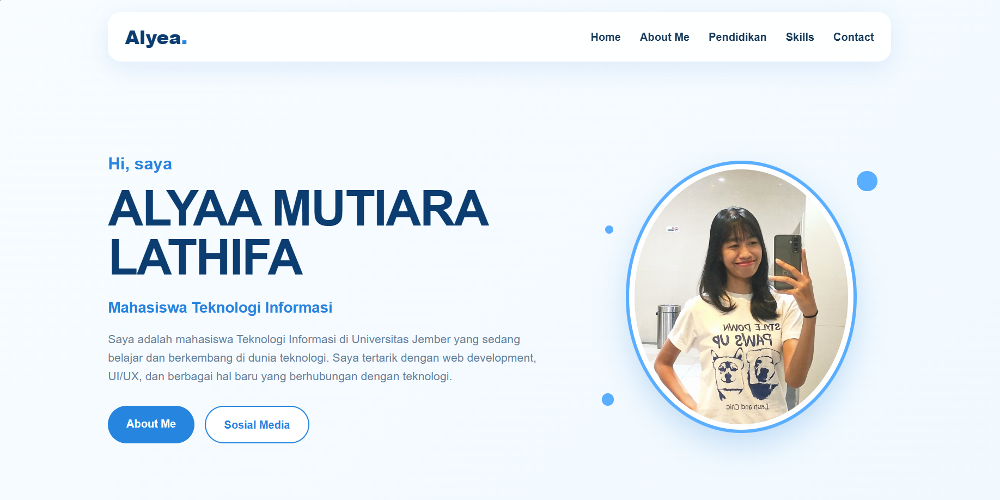
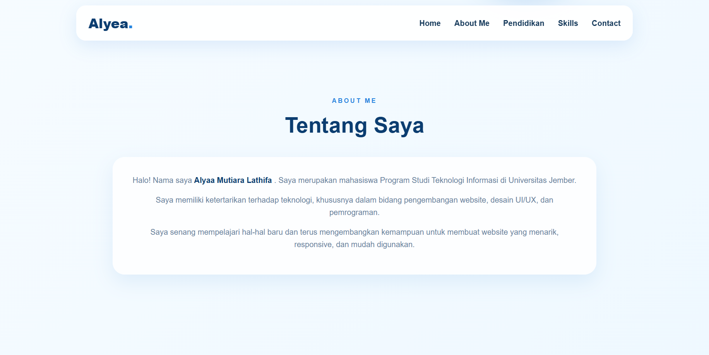
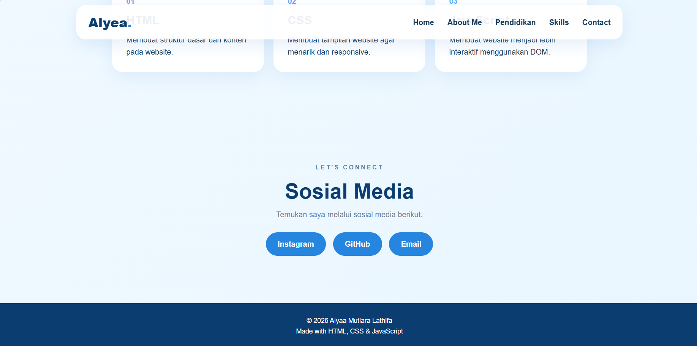
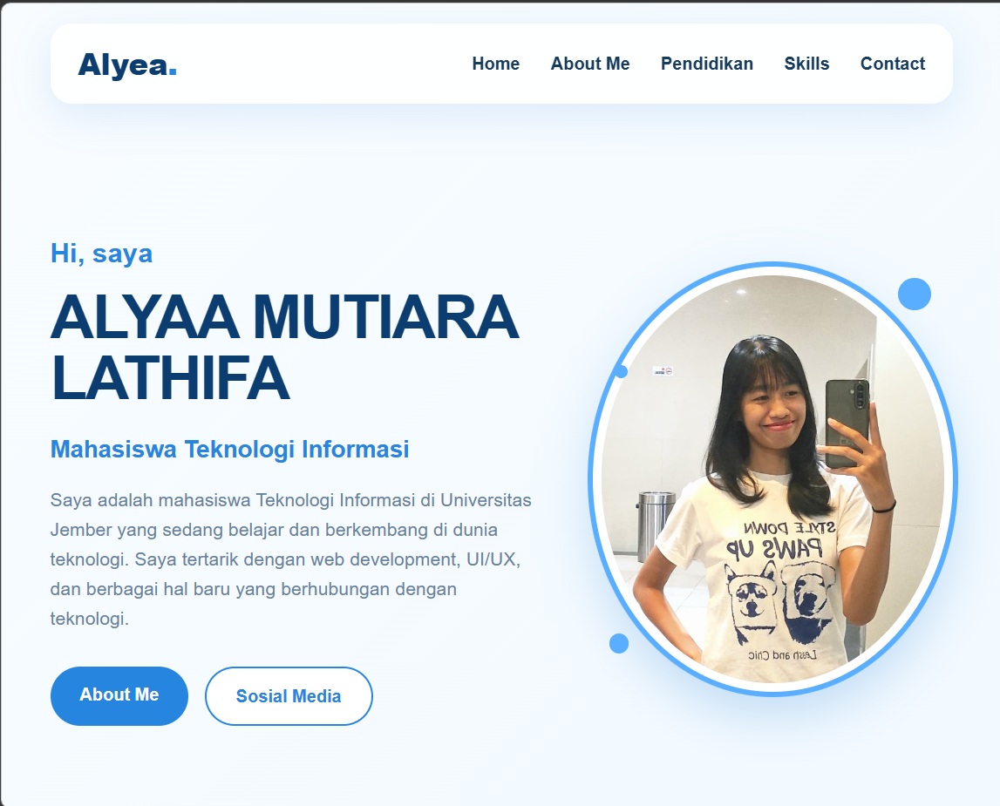
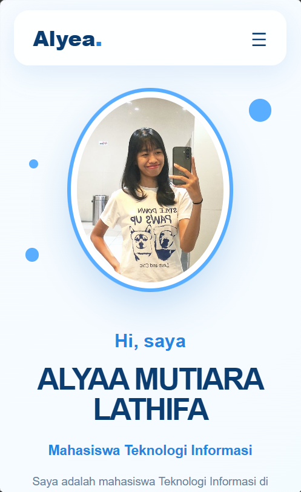

## Tampilan Web

### Desktop








### Tablet



### Mobile



## Teknologi yang Digunakan

- HTML
- CSS
- JavaScript

## Responsive

Website dibuat responsive sehingga dapat menyesuaikan tampilan pada perangkat desktop, tablet, dan mobile.

Pada ukuran layar yang lebih kecil, menu navigasi akan berubah menjadi menu hamburger agar lebih mudah digunakan.

## Struktur File

```text
tugas1pweb_alyaa-mutiara_2025/

├── index.html
├── README.md
├── script.js
├── style.css
├── profile.jpg
├── desktop-home.png
├── desktop-about.png
├── desktop-education.png
├── desktop-education2.png
├── desktop-education3.png
├── tablet.png
└── mobile.png